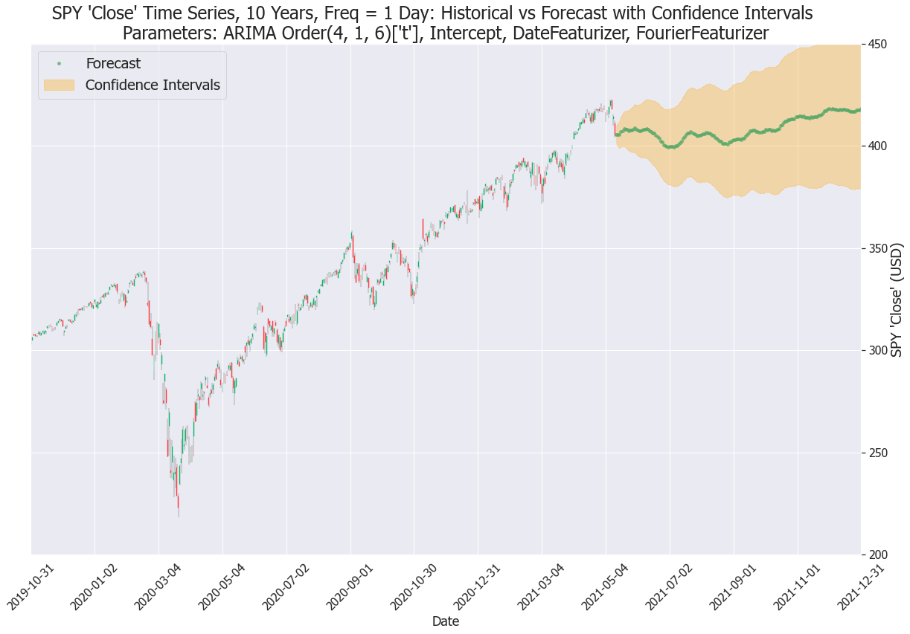

# I SPY: Time Series Analysis for SPY ETF for Flatiron School Data Science Immersive (Capstone Project)
  
## Overview  
In this project, we examine and perform time series analysis on the [SPDR® S&P 500® ETF Trust](https://www.ssga.com/us/en/institutional/etfs/funds/spdr-sp-500-etf-trust-spy) to forecast future prices and inform trading decisions.  See also: [Medium article](https://medium.com/geekculture/i-spy-a-time-series-analysis-f12fc1e3252e) discussing this project.

  
  
## Business Problem  
While institutional investors leverage enterprise-grade data feeds and models to plan and execute trades in the sub-second timeframe, amateur investors are limited primarily to free data and tools to make investment decisions. The goal is to take freely available public data and, leveraging machine learning modalities to predict the movement of financial instruments, help the little guy get on the right side of the trade, more often than not. The ticker 'SPY' (aka "Spiders") was chosen because it is well-established, not volatile, and highly liquid.

## Data  
Our primary SPY time series data comes the [yfinance API](https://github.com/ranaroussi/yfinance). We focused on the Close price marked at EOD of each trading data as well as the Volume traded as our first exogenous variable. Other exogenous variables -- the US Treasury 10 Year Note yield, the Federal Funds Target Rate, and the Federal Funds Effective rate -- come from the [Quandl API](https://www.quandl.com/tools/python). Our last exogenous variable is a binary indicator on whether a date is a SPY option expiry date; this was an engineered feature.

### Historical Data  
The SPY ETF, since it tracks the S&P 500 Index, show positive growth over time, and has tripled in price in the last 10 years. There is also some cyclical trends and seasonality present.  
 
### Target Variable  
We will forecast SPY closing price up through the end of the year (below from Yahoo! Finance).
  

## Methods  
Our methodology implements the CRISP-DM model for exploratory data analysis, cleaning, modeling, and evaluation.  
We leveraged ARIMA modeling from [pmdarima](http://alkaline-ml.com/pmdarima/) to analyze and forecast SPY closing prices. We leveraged the Date Featurizer, Fourier Featurizer, and the Logarithmic Featurizer. The quality of our modeling was inferred from [AIC value](https://en.wikipedia.org/wiki/Akaike_information_criterion) and evaluated with [RMSE](https://en.wikipedia.org/wiki/Root-mean-square_deviation) and [SMAPE](https://en.wikipedia.org/wiki/Symmetric_mean_absolute_percentage_error). We also utilized statistical tools via [SciPy Stats](https://docs.scipy.org/doc/scipy/reference/stats.html) to adjust confidence intervals on the model predictions.  
Other tools used include NumPy, Pandas. Visualizations were created with MatPlotLib and Seaborn.  

## Approach
### Data Gathering and Cleaning
Using various sources, we collected time series data for our target (endogenous) variable and several exoenous variables. We also engineered a feature for option expiration dates.

First we needed to ensure our various time series across all variables would match up in terms of number of observations. To do this, we pulled in [Pandas market calendars](https://pypi.org/project/pandas-market-calendars) and normalized all data against the NYSE calendar, interpolating (minimally) as needed.

Once all the data was loaded and normalized, we can visualize to get a sense of what the data looks like. Here is the 10 year slice showing our target variable and three of the exogenous variables:
  

### Time Series Analysis
We tested stationarity and determined that differencing once was needed.

We analyzed PACF, ACF, and seaonality for our target variable, SPY `close` price, to estimat the AR (autoregressive), MA (moving average), and seasonality of our ARIMA modeling. In the interest of brevity, this is not included here, but can be view in the final notebook. The analysis suggested AR = 1 and MA = 1, however later analysis found higher orders produced better models. 

Additionally, seasonality appeared to be strong at a period of 4 years, though it was also significant at 1 year, and 1 quarter (3 months). Trend appeared mostly linear.

### Time Series Modeling
We began testing with SARIMAX, the Python statsmodels implementation, however our efforts achieved unsatisfactory results. We also looked into Prophet but felt limited in ability to tune parameters. We compared Linear Regression and Logistic Regression, and results were close to 50/50 predictions.

Instead, we write a custom implementation of pmdarima. Using the built-in AutoARIMA parameter discovery tool of Pmadarima, ARIMA (0, 1, 0) was recommended. However, further testing would show that this was insufficiently robust.

Additionally, we tested and implemented the pmdarima preprocessing transformers: DateFeaturizer, FourierFeaturizer, BoxCoxEndogTransformer, and LogEndogTransformer. Our tests indicate that DateFeaturizera and FourierFeaturizer are optimal for our price and index time series, and that `volume` can be modeled better with the addition of LogEndogTransformer.

The [Fourier Featurizer](https://alkaline-ml.com/pmdarima/modules/generated/pmdarima.preprocessing.FourierFeaturizer.html) is especially powerful because it enables the modeling of seasonality without explicitly fitting a seasonal order in SARIMAX. This approximation saves significant computation time, and even allows us to modeling _multiple_ seasonalities without letting our soup get cold.  

### Model Validation
We wrote and implemented a Step-Wise Cross-Validation tool to make iterative in-sample predictions to determine model fit and accuracy. We built a custom GridSearch function to test out different model paremeters, scoring each model via the aforementioned StepWiseCV using RMSE and SMAPE, saved in CSV. Best models were found for each variable (target as well as all exogenous variables). Here are examples of visualization of this process: 

### Historical Simulation
To further validate our best-scoring model, we implemented a historical simulation profit calculator to evaluate how the model would perform if tested against the market (i.e. against buying and holding).

For each day, a Buy signal would be triggered if the observed price is lower than the predicted price, vice versa for Sell.  We implemented hyperparameters for the trading strategy simulation: confidence interval (`z`) and Limit price offset (`lim`).  Using default values for these parameters, our model did not beat the Buy and Hold Strategy.

But all was not lost - using another custom GridSearch class, we tuned the aforementioned strategy parameters to determine the highest possible profit. Here is a visualization of the profit optimization problem:

Then, applying the best parameters to the historical simulation, we found that a trading strategy implementing our new model would beat the Buy and Hold strategy by **25%**:

  
## Conclusion
After running ARIMA analysis on various combinations of timeframes, observation frequencies, and seasonalities, we chose daily frequencies with a yearly seasonality, for a 10 Year timeframe.

Using our custom GridSearchCV function, we found ideal parameters for our model for the SPY Close as well as SPY Volume and each of our exogenous variables that minimize RMSE as a percent of the mean of the time series when compared against observed values. We also added a quarterly seasonality and a 4-year seasonality.
Via our historical simulation GridSearch, we found ideal strategy parameters for our model to maximize profit from trading using predicted prices vs observed SPY Close.

Lastly, we forecasts 52 days ahead as well as until year-end for our exogenous variables and, using those as inputs, forecasted SPY Close 52 days and until year-end. Here is the visualization, showing confidence intervals:

### Best Models
Here is a summary of our best models for the 10 Year time series:  

Variable            | Parameters                                  |  AIC      | RMSE (% of mean) |  SMAPE 
:-------------------|:--------------------------------------------|----------:|-----------------:|---------:  
Close               | Arima(4,1,6), Intercept, Trend='t', Fourier | 11939.92  |       4.59%      |  0.96%
Volume              | Arima(1,0,1), No Intercept, Fourier, Log    |  849.94   |      24.86%      | 24.82%
TSY 10Y             | Arima(0,1,0), Intercept, Trend='c'          | -8287.71  |       2.17%      |  3.22%
Fed Funds Target    | Arima(1,0,0), No Intercept                  | -10827.33 |       7.71%      |  0.66%
Fed Funds Effective | Arima(1,0,0), No Intercept                  | -10467.00 |       8.86%      |  4.37%

### Results
We found our model was accurate enough such that trading with it using tuned hyperparameters was able to beat the market by **25%** over the span of the time series.

Our forecasting results so far are encouraging: the model predicted a year-end price of **$418.34**, representing an S&P Index level of 4183, which compares well against the average projection on [Wall Street](https://www.cnbc.com/market-strategist-survey-cnbc) of 4207.

## Further Actions  
- We will build a Buy/Hold/Sell indicator to recommend **trading decisions**, as well as implement a _profit calculator_ using historical data to evaluate _model performance_ in the real world compared against simpling buy and holding.  **[DONE]**
- Using aditional **exogenous variables** such as SPY Futures data, recession dates, options trade data, options expiry date, jobs data, and Treasury yield curve data, we will be able to implement a more robust model.  **[DONE for options expiry dates, Treasury yield curve data, Federal Funds Target and Effective rates]**
- Additional _time series_ **modeling** can be built using TBATS, Facebook Prophet. We can also explore _neural networks_ such as LSTM, RNN, CNN to model and predict on SPY closing price. Initial results on _logistic regression_ has shown some promise, and we can delve into that as well.  
- We can build a **web-scraping tool** to gather and anayze _market sentiment_ on Twitter, Reddit, etc.
- Using available libraries as well as creating our own, we can plot and incorporate **technical indicators** such as MACD, RSI, Bollinger Bands, Support/Resistance, Stochastic, CCI, OBV, and Elliot Wave Analysis into our model.  
- Finally, we can create a **real-time model** that will automatically fetch and run models on each new observation. We can then build a _web app_ to allow us to access these predictions on the fly.
- Trade on it! By using the TD Ameritrade API, we can **algorithmically trade** based on our model predictions. This can be done with shorter time windows instead of once per day.

## Repository Structure
    .
    ├── code/                                       # python code files
        ├── functions.py                            # helper functions
        ├── Gridsearch_Calc_Profit.py               # class for running GridSearch on historical simulation parameters
        ├── Model_Historical_Simuluation.py         # class for running historical simulations
        ├── Pmdarima_Model.py                       # class for running pmdarima models and tools
        └── regressions.py                          # code for running regressions
    ├── crisp_dm_process/                           # initial EDA and model notebook files 
        ├── av_eod_eda_modeling.ipynb               # data exploration and modeling on AlphaVantage data using SARIMAX
        ├── yf_eda_modeling_colab.ipynb             # data exploration and modeling using Google Colab
        ├── yf_eda_modeing.ipynb                    # data exploration and modeling on yfinance SPY data using pmdarima
        └── yf_fut_eda_modeling.ipynb               # date exploration and modeling using yfinance SPY Futures data
    ├── data/                                       # project data sets
        └── prepared_data/                          # engineered data
    ├── I SPY - ETF Price Predictions.pdf           # presentation slides PDF
    ├── images/                                     # all image files, EDA visualizations, etc.
        ├── AutoArima/                              # AutoArima in-sample test predictions
        ├── Final Images/                           # curated images for README
        ├── GridSearch/                             # GridSearch in-sample test predictions
        └── model_profit/                           # visualizations of historical simulation model profit; GridSearch heatmaps
    ├── model_CV_scores/                            # CSV files of Step-Wise Cross-Validation scores during time-series modeling
    ├── model_profit_GS/                            # CSV and pickled files of historical simulation GridSearch
    ├── models/                                     # pickled model files
    ├── README.md                                   # this README
    ├── sound/                                      # audio file to provide alert after code execution
    ├── spy_final_notebook.ipynb                    # final project notebook
    └── Wei Alexander Xin - Final Presentation.mp4  # recording of presentation
  
## Bibliography  
1. Dataset:  
  
       Yahoo! Finance Stock Data  
            Yahoo! Group  
   Last Access:    Wednesday May 12, 2021.  
   Web Source:  https://finance.yahoo.com/quote/SPY            
2. Exogenous Data:
    1. US Treasury Bond Yield Data

           US Treasury Bond Yield Data
           Treasury Direct
           U.S. Department of the Treasury, Bureau of the Fiscal Service. 
    Last Access:    Wednesday May 12, 2021.  
    Web Source:  https://www.treasurydirect.gov/indiv/products/prod_tnotes_glance.htm  
    
    2. Federal Funds Target Rate Data

           Federal Reserve Economica Data
           Federal Reserve Bank of St. Louis
    Last Access:    Wednesday May 12, 2021.  
    Web Source:  https://fred.stlouisfed.org/series/DFEDTARU
    
    3. Federal Funds Effective Rate Data

           Federal Reserve Economica Data
           Federal Reserve Bank of St. Louis
    Last Access:    Wednesday May 12, 2021.  
    Web Source:  https://fred.stlouisfed.org/series/FEDFUNDS

Author 
  
Wei Alexander Xin  
    
[Alexander's GitHub](https://github.com/eggrollofchaos)  
[Alexander's LinkedIn](https://www.linkedin.com/in/waximus)
